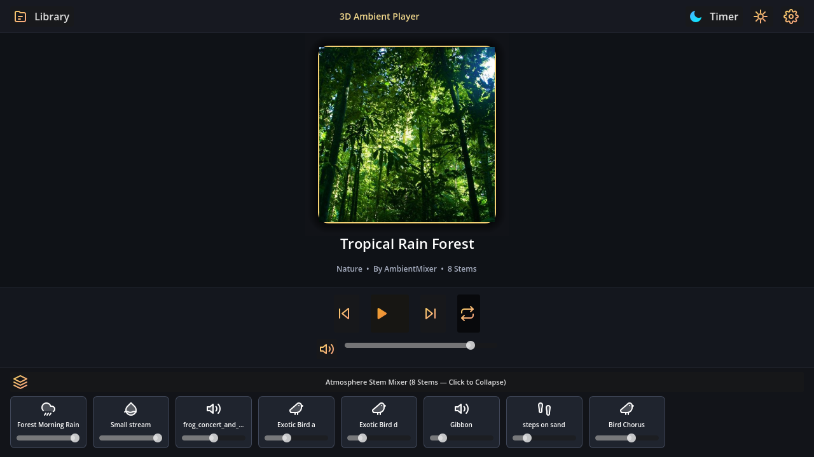
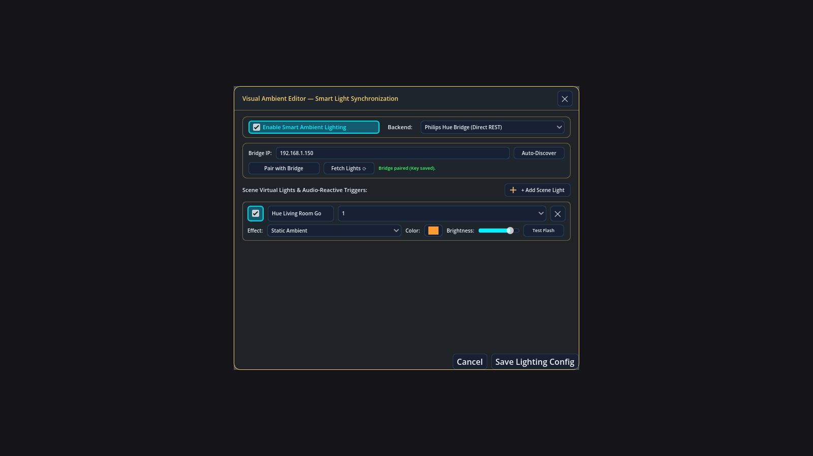
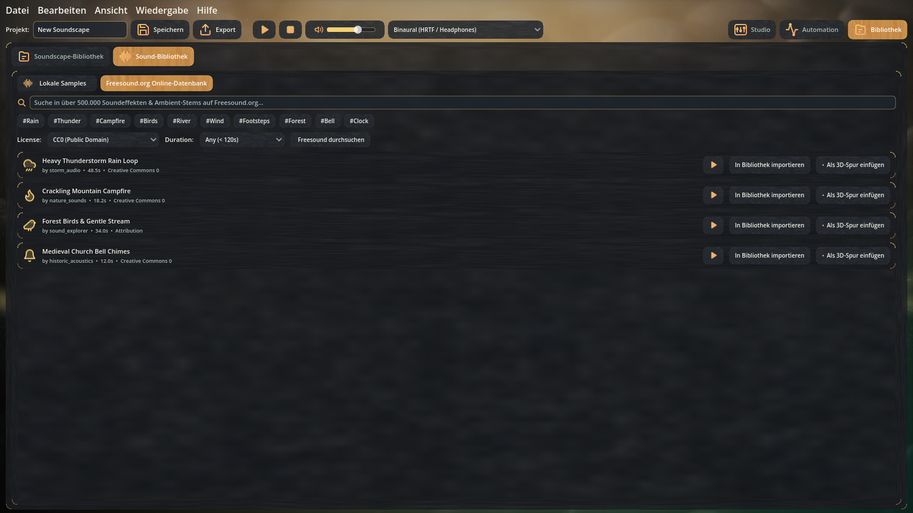

# 🎧 3D Soundscape Studio

[](https://github.com/adromir)
[](https://github.com/adromir/3D-Soundscape-Studio)
[](https://godotengine.org/)
[](wiki/Home.md)
[](https://opensource.org/licenses/MIT)
[](#)
[](#)
[](#)
[](#)
[](#)

A modern, high-performance desktop Digital Audio Workstation (DAW), 3D spatial soundscape generator, and dedicated standalone **3D Ambient Player** engineered for binaural audio, multi-channel surround rendering, interactive polar audio positioning, portable project packaging (`.3dscape`), Philips Hue smart ambient lighting, generative relaxation audio, and cross-platform native execution across **x86_64, ARM64 (aarch64), and Apple Silicon**.

> 📚 **Explore the [Full Visual Wiki Documentation](wiki/Home.md)** with detailed feature guides, architecture diagrams, and tutorials.

---

## 🌟 What the Project Does

**3D Soundscape Studio** and the **3D Ambient Player** empower sound designers, composers, tabletop RPG masters, game developers, and relaxation listeners to craft and enjoy living virtual audio environments in 3D space:

- **🎧 Dedicated Standalone 3D Ambient Player (`3D-Ambient-Player`):** A lightweight, meditative player for Windows, Linux, macOS, Android, and iOS. Features an expandable Atmosphere Stem Mixer drawer, breathing vinyl visualizer halo, sleep timer with 15-second gentle audio fade-out, 1-click `.3dscape` package import, and theme customization without DAW overhead.
- **💡 Native Philips Hue & Home Assistant Smart Lighting:** Synchronize physical room lights with your soundscape. Features local Hue Bridge auto-discovery, 30-second push-link pairing, wide-gamut CIE 1931 xy color math, instant lightning strobe flashes ($0\text{ms}$ transition), fireplace hearth flicker, and listener proximity dimming.
- **🧱 Acoustic Environments, Raycast Occlusion & Barriers:** Place physical barrier walls directly on the soundstage. Features real-time line-of-sight raycast occlusion that realistically muffles high frequencies while allowing low-end diffraction, plus environmental room reverb presets.
- **🌡️ Real-Time Acoustic Heatmap & Sound Pressure Field Visualizer:** High-performance GPU shader computing live sound pressure distributions with Iso-dB contour rings across 3 visual palettes (*Thermal*, *Phosphor*, *Cyberpunk*) toggled with **`H`**.
- **🎵 Freesound.org REST API Integration & Audition Streaming:** Search and browse hundreds of thousands of open-source sound effects directly inside the studio with tag chips, CC0 / CC-BY license filters, zero-cache in-memory streaming audio preview, and 1-click 3D soundstage placement.
- **⚡ 1-Click Dependency Downloader:** Automated cross-platform downloader and installer for `audio.cpp`, FFmpeg, and recommended AudioGen GGUF diffusion models on Windows, Linux, and macOS.
- **📦 Portable Soundscape Project Packaging (`.3dscape` / `.zip`):** Export and import self-contained soundscape archives containing track coordinates, listener movement paths, trigger schedules, metadata, cover artwork, and all referenced audio stem files with zero missing-file errors.
- **🎯 Interactive 3D Spatial Radar:** Visually position audio sources relative to a central listener with real-time azimuth, elevation, and distance attenuation (up to 30m soundspaces) with live drag & drop.
- **🌐 Native Ambient-Mixer Downloader & Importer:** Download soundscapes directly from [ambient-mixer.com](https://www.ambient-mixer.com/) with stem extraction, automatic URL subdomain categorization, metadata parsing, and cover art preservation.
- **🤖 Local AI Audio Generation (`audio.cpp`):** Generate ambient sound effects and audio loops seamlessly from text prompts inside the sample library, running entirely locally on CPU/GPU via native GGUF models.
- **📚 Integrated Soundscape & Samples Library:** Full-screen tabbed library workspace (`F3` / `F4`) for browsing soundscapes, editing metadata (title, author, category, cover artwork), and managing standalone sample sound banks.
- **🛤️ Listener Automation & Motion Paths:** Draw smooth motion paths for a virtual walking listener with real-world speed controls ($m/s$ and $km/h$), open/closed loop trajectories, and live waypoint stats.
- **🎛️ In-Inspector Multi-Channel Routing Grid:** Route tracks as pinpoint 3D sources, omnipresent ambient beds, or discrete speaker channels (`FL`, `FR`, `FC`, `LFE`, `BL`, `BR`, `SL`, `SR`, `TFL`, `TFR`, `TBL`, `TBR`) with 1-click surround presets.
- **🎲 Authentic Randomness & Interval Engine:** Schedule stem playback with seamless crossfade loops, periodic fixed intervals, or authentic Ambient-Mixer random frequency distributions ($1$ to $60$ counts per $1\text{m}$ to $4\text{h}$ window) with minimum cooldown guards.
- **🚀 Fast Offline Multi-Channel & Binaural Exporter:** Asynchronously render production-ready binaural stereo files (via HRTF `.sofa` files and `sofalizer`), Stereo, Quadraphonic (4.0), 5.1 Surround, and 7.1 Surround with dynamic audio normalization (`dynaudnorm`) and convolution reverb (`afir`).
- **🎨 Pro DAW Liquid Glass Aesthetics:** Frosted translucent glass panels over dynamic ambient caustic shader backdrops with 8 handcrafted theme styles and high-contrast light mode.
- **🌍 100% 5-Language Localization:** Instant real-time UI switching across **English**, **German**, **French**, **Spanish**, and **Italian**.

---

## 🚀 Key Advantages & Why Users Should Use It

1. **Effortless Soundscape Sharing (`.3dscape` Packages):** Bundle entire complex projects—including all audio files and 3D spatial settings—into a single portable `.3dscape` package file to share directly with friends, collaborators, or future standalone players.
2. **True Spatial Audio Without Complex DAWs:** Position sounds intuitively on a visual polar radar without needing complex routing plugins or professional audio engineering experience.
3. **Deterministic Offline Rendering:** Export hours of generative or spatialized soundscapes in minutes using FFmpeg's hardware-accelerated 64-bit float filtergraphs with zero buffer underruns or frame drops.
4. **Authentic Ambient-Mixer Scraper:** Download and expand thousands of online community soundscapes directly into spatial 3D audio environments.
5. **Cross-Platform & Dependency-Free:** Built natively in Godot 4.x and GDScript with pure native HTTP scraping, native ZIP packaging, and zero external runtime dependencies.
6. **Robust Security & Data Integrity:** Magic byte audio verification (Ogg, MP3, WAV), strict directory traversal (`..`) protection during package extraction, and local-first data storage (`./data/`).

---

## 📦 Tech Stack & Architecture

- **Frontend & Core Engine:** Godot Engine 4.x (GDScript)
- **Real-Time Spatial Audio:** Godot `AudioServer`, `AudioStreamPlayer3D`, `Camera3D`, and `AudioListener3D`
- **Offline Audio Rendering Engine:** FFmpeg (compiled with `libmysofa` for HRTF filtering)
- **Local AI Audio Generation Engine:** `audio.cpp` native C++ inference via GGUF models
- **HRTF Spatialization:** Standardized `.sofa` (Spatially Oriented Format for Acoustics) data files
- **Project File Formats:**
  - `.3dscape` / `.zip`: Portable self-contained archive (`project.ambmix` + `metadata.json` + `cover.*` + `audio/` stems)
  - `.ambmix`: JSON-based serialized soundscape configuration format
- **Design System:** Pro DAW Liquid Glass with custom shaders, responsive docks, and vector SVG icon system

---

## 📥 Download & Installation

### 🚀 Pre-Compiled Releases (Recommended)

Pre-built, standalone, ready-to-run releases are available for **Windows**, **Linux**, **macOS**, and **Android** on the official [**GitHub Releases**](https://github.com/adromir/3D-Soundscape-Studio/releases) page.

| Target Platform | Package Format | Architecture | Highlights |
| :--- | :--- | :--- | :--- |
| **🪟 Windows** | `.msi` Setup Installer | `x64` | Native Windows Installer with Desktop & Start Menu shortcuts |
| | `.zip` Portable | `x64`, `ARM64` | Standalone portable archive, zero installation required |
| **🐧 Linux** | `.AppImage` Universal | `x86_64` | Self-contained universal binary, runs on all modern distributions |
| | `.deb` Package | `amd64`, `arm64` | Native package for Debian, Ubuntu, Linux Mint, Pop!_OS |
| | `.tar.gz` Portable | `x86_64`, `arm64` | Lightweight portable archive with executables and desktop icon |
| | `.flatpak` Bundle | `x86_64` | Sandboxed desktop application package |
| **🍎 macOS** | `.dmg` Disk Image | `Universal` (Apple Silicon & Intel) | Drag-and-drop installer into `/Applications` |
| | `.zip` Portable | `Universal` (Apple Silicon & Intel) | Standalone `.app` bundle |
| **🤖 Android** | `.apk` Package | `ARM64-v8a` | Standalone mobile ambient player for phones and tablets |

> 💡 **Both Applications Included:** Every release archive provides both the full **3D Soundscape Studio DAW** (`3D-Soundscape-Studio`) and the distraction-free **3D Ambient Player** (`3D-Ambient-Player`).

---

### 🛠️ Running / Building from Source

For developers modifying the code or contributing features:

1. **Prerequisites:**
   - [Godot Engine 4.3+](https://godotengine.org/download) (Standard build)
   - [FFmpeg](https://ffmpeg.org/download.html) (placed in system `PATH` or next to executable)

2. **Clone and Launch:**
   ```bash
   git clone https://github.com/adromir/3D-Soundscape-Studio.git
   cd 3D-Soundscape-Studio
   ```
3. Open Godot Engine, import `project.godot`, and press **F5** to run.

---

## 📖 Usage Guide

### 1. Exporting & Importing Soundscape Packages (`.3dscape`)

- **Export Package:** Go to **File > Export Soundscape Package (.3dscape)...** (`Ctrl+Shift+E`), or click the **`[ 📦 ]`** button on any soundscape card.
- **Import Package:** Go to **File > Import Soundscape Package (.3dscape)...** (`Ctrl+Shift+I`), or simply **drag and drop** a `.3dscape` file anywhere onto the window!

### 2. Positioning & Spatializing Tracks

- **Drag & Drop:** Click and drag any audio stem puck on the central radar canvas to adjust azimuth and distance.
- **Elevation & Spread:** Use the right-hand **Track Inspector** to adjust height ($-90^\circ$ to $+90^\circ$) and spatial spread.
- **Routing:** Toggle between `3D Point Source`, `Omnipresent (All Around)`, or `Multi-Channel Specific` (`FL`, `FR`, `FC`, `LFE`, `BL`, `BR`, `SL`, `SR`, `TFL`, `TFR`, `TBL`, `TBR`).

### 3. Acoustic Barriers & Sound Pressure Heatmap

- **Acoustic Heatmap:** Press **`H`** anytime to view the live GPU sound pressure field with Iso-dB contour rings in Thermal, Phosphor, or Cyberpunk palettes.
- **Barrier Occlusion:** Draw physical wall obstacles on the radar; sound passing through walls is realistically muffled using dynamic low-pass filtering.

### 4. Freesound.org & Local AI Audio Generation (`F4`)

- Open the **Sample Browser** (`F4`).
- **Freesound**: Search online sound effects by tags (`#Rain`, `#Thunder`, `#Campfire`), filter by CC0 licensing, and stream in-memory previews.
- **Local AI Audio (`audio.cpp`)**: Enter a prompt (e.g. *"crackling campfire with gentle breeze"*) and render locally on CPU/GPU via GGUF models.

### 5. Simulating Listener Movement (`F2`)

- Switch to the **Automation** tab (`F2`).
- Click to place waypoints for walking paths, adjust speeds ($m/s$ or $km/h$), and toggle Open Path / Closed Loop modes.

### 6. Exporting Multi-Channel & Binaural Audio (`Ctrl+E`)

- Press **Export** (`Ctrl+E`).
- Select speaker layout: `Binaural HRTF` (`.sofa`), `Stereo`, `Quad 4.0`, `Surround 5.1`, `Surround 7.1`, or `7.1.4 Dolby Atmos`.
- Click **🚀 Start Audio Render** for deterministic, buffer-underrun-free offline rendering via FFmpeg.

### 7. Dedicated Standalone 3D Ambient Player

- **Launch Directly:** Run `3D-Ambient-Player.exe` (or pass `--player` / `-p`).
- **Atmosphere Stem Mixer:** Expand the bottom drawer to adjust individual stem volumes (rain, wind, stream, wildlife).
- **Sleep Timer:** Select 15m to 2h countdown with automatic 15-second gentle audio fade-out.

### 8. Philips Hue & Smart Ambient Lighting (`F7`)

- Open **Tools > Visual Ambient Lighting (Hue & HA)...** (`F7`).
- Auto-discover local Hue Bridges, click Pair, and map lights to lightning flashes, candle hearth flicker, and distance-based dimming.

---

## 🖼️ Screenshots

| 🎛️ 3D Soundscape Studio DAW Overview | 🎯 3D Radar with Acoustic Heatmap (`H`) |
| :---: | :---: |
|  |  |

| 🎧 Dedicated Standalone 3D Ambient Player | 💡 Philips Hue & Smart Ambient Lighting |
| :---: | :---: |
|  |  |

| 🛤️ Listener Automation & Motion Paths | 🎵 Freesound Search & AI Audio Generation |
| :---: | :---: |
|  |  |

| 📚 Soundscape Library & Packaging | 🔊 Multi-Channel Surround & Offline Export |
| :---: | :---: |
|  |  |

---

## ⚖️ Disclaimer

This software is designed for personal, creative, and educational soundscape composition. Audio files downloaded from third-party services are subject to their respective creators' copyright and licensing terms.

---

## 📄 License

Distributed under the **MIT License**. See `LICENSE` for details.

---

**Author:** Adromir  
**Website:** [https://github.com/adromir](https://github.com/adromir)  
**Repository:** [https://github.com/adromir/3D-Soundscape-Studio](https://github.com/adromir/3D-Soundscape-Studio)
