# 3D Soundscape Studio — Documentation & Wiki

Welcome to the **3D Soundscape Studio** documentation repository. Below you'll find comprehensive visual guides and manuals for every feature in the application.

---

## 📚 Table of Contents

1. [📖 Getting Started & Studio Overview](../wiki/Home.md)
2. [🎯 3D Spatial Audio Radar](../wiki/3D-Spatial-Audio-Radar.md)
3. [🛤️ Listener Automation & Motion Paths](../wiki/Listener-Automation-&-Motion.md)
4. [🎛️ Stem Audio Tracks & Parameter Inspector](../wiki/Stem-Audio-Tracks-&-Parameter-Inspector.md)
5. [📚 Soundscape Library & Ambient-Mixer Import](../wiki/Soundscape-Library-&-Ambient-Mixer-Import.md)
6. [🔊 Multi-Channel Surround & Offline Export](../wiki/Multi-Channel-Surround-&-Offline-Export.md)
7. [🎨 Themes, Localization & Preferences](../wiki/Themes-Localization-&-Preferences.md)

---

## 🖼️ Documentation Screenshots Gallery

| Studio Overview (Zen Theme) | 3D Spatial Radar & Inspector |
| :---: | :---: |
| 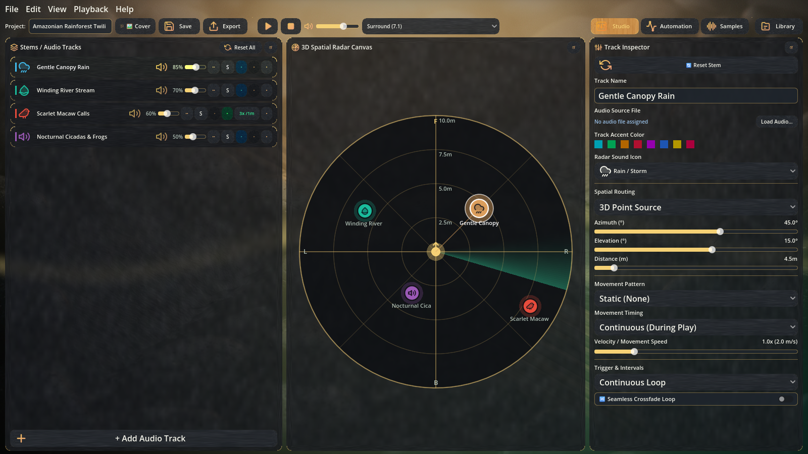 | 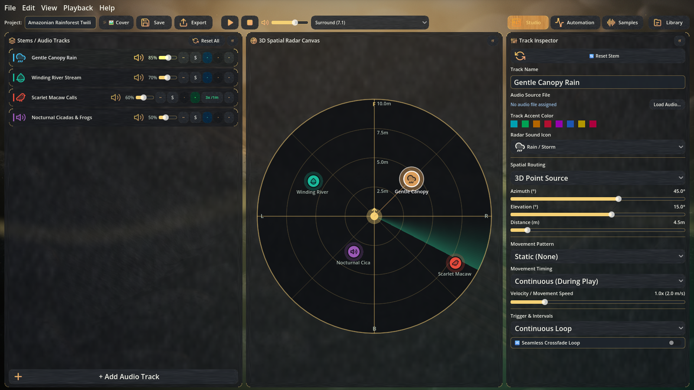 |

| Listener Automation View | Sample Browser & Category Editor |
| :---: | :---: |
| 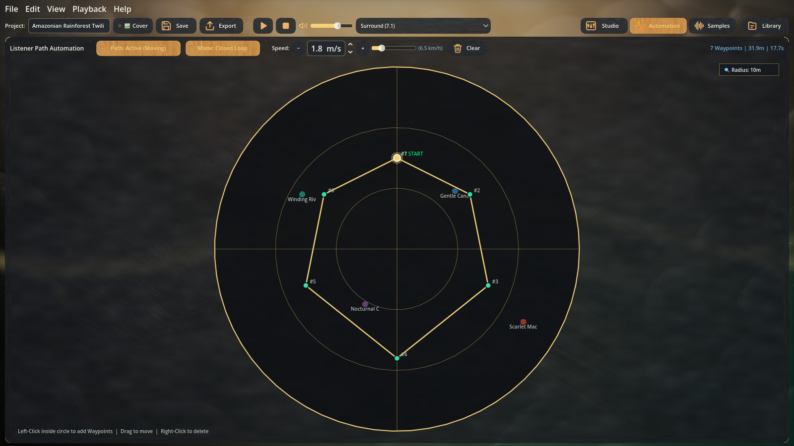 | 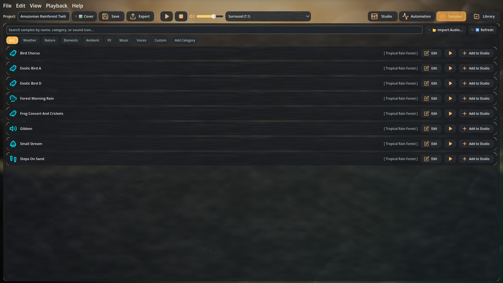 |

| Soundscape Library & Ambient-Mixer | Multi-Channel Surround Export |
| :---: | :---: |
| 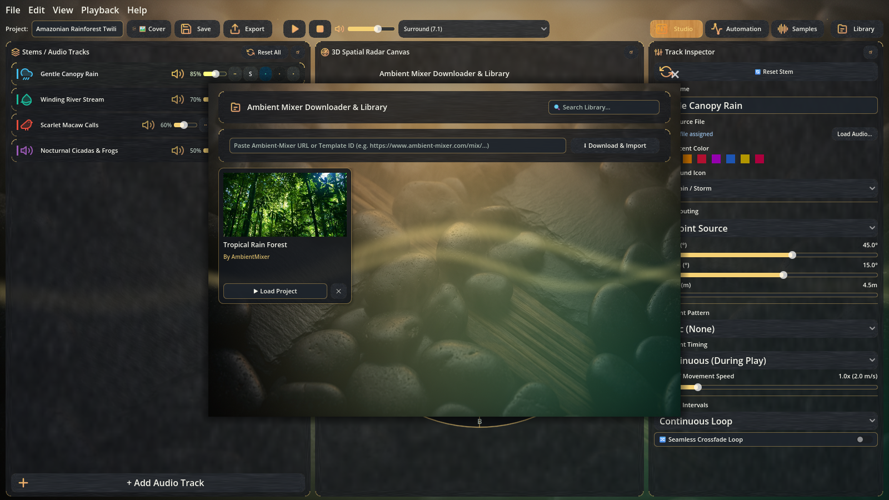 | 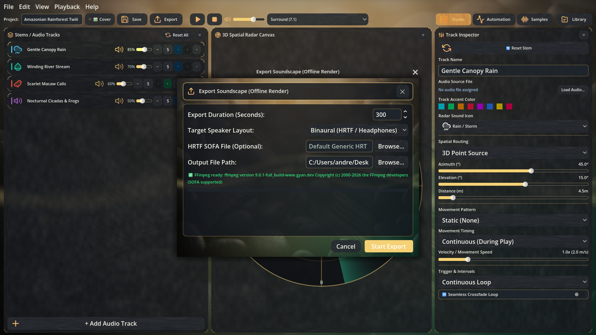 |

| Preferences & Audio Settings | Themed About Dialog & MIT License |
| :---: | :---: |
| 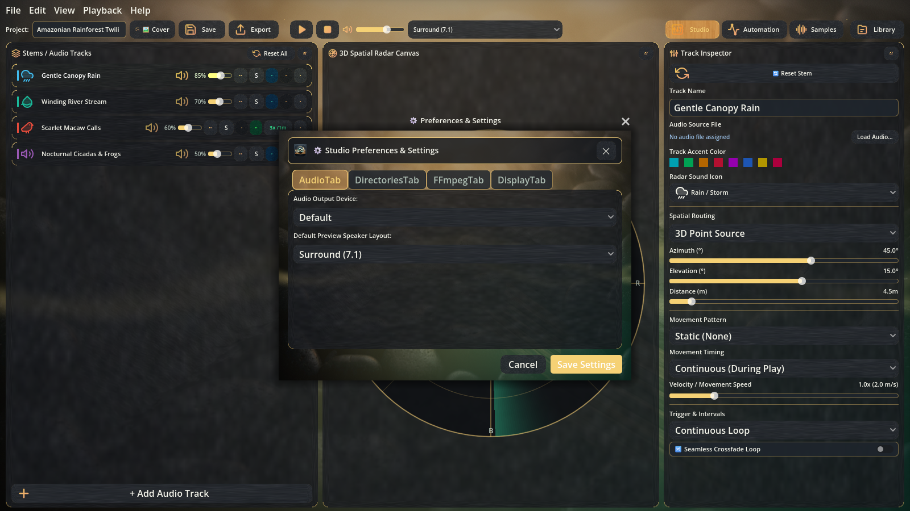 | 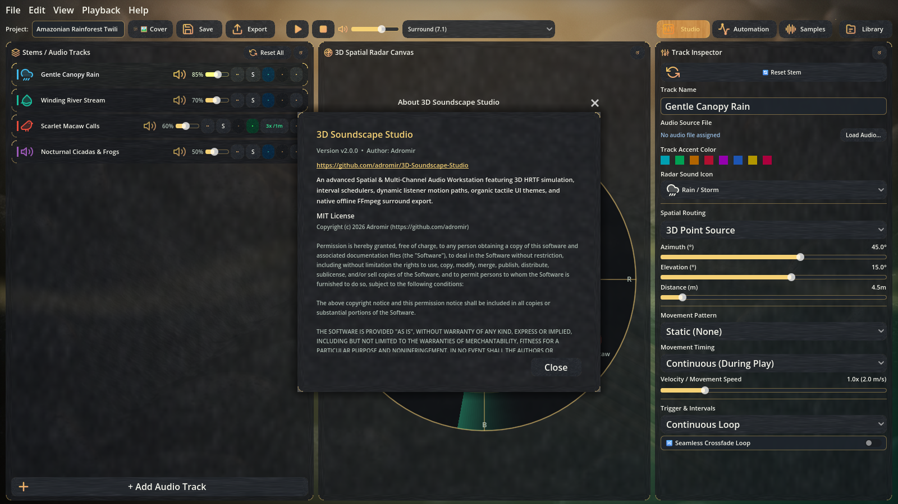 |

| Dark Slate Studio Theme | Cyberpunk Neon Theme | High-Contrast Light Theme |
| :---: | :---: | :---: |
| 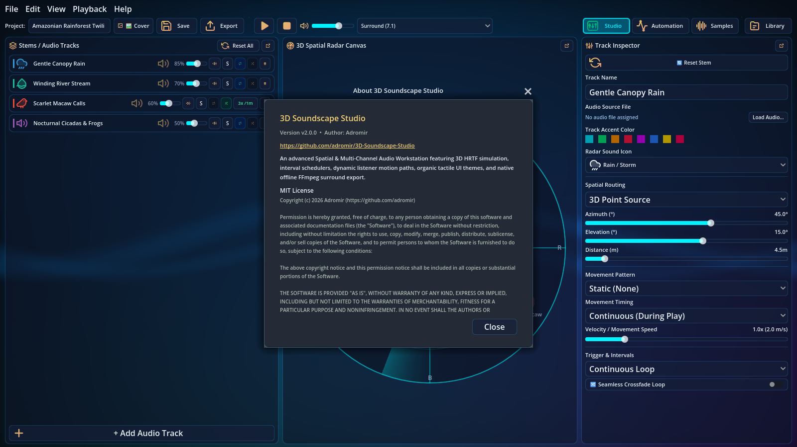 | 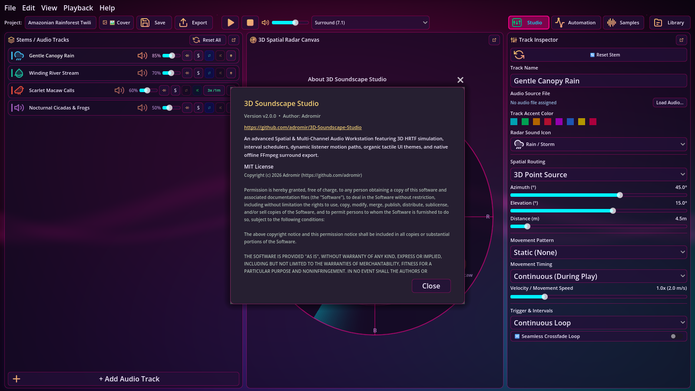 | 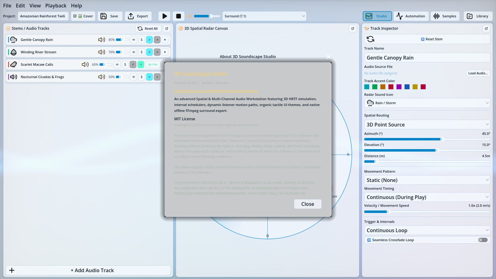 |

---
**Author**: [Adromir](https://github.com/adromir) • **License**: [MIT License](https://github.com/adromir/3D-Soundscape-Studio/blob/main/LICENSE)
